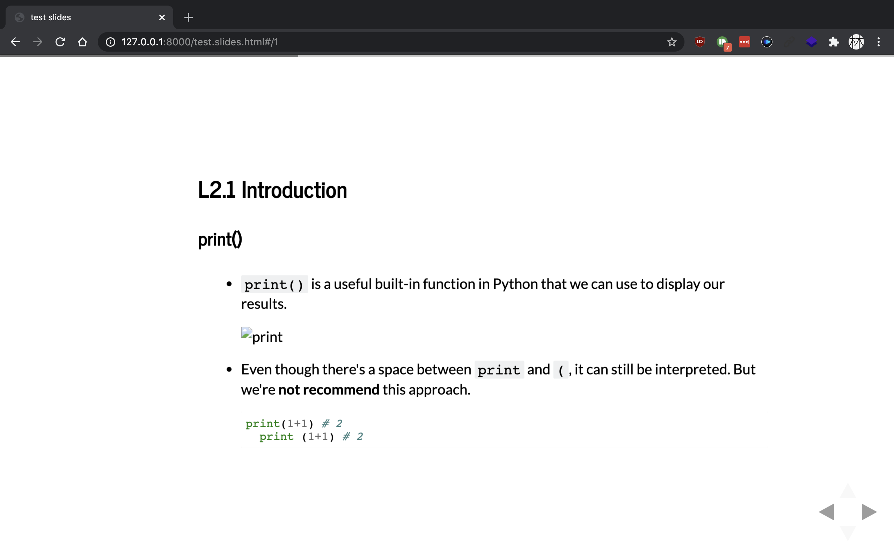

# Jupyter Notebooks

<details><summary>Outline</summary>
<Dropdown Content>

- [Jupyter Notebooks](#jupyter-notebooks)
  - [L2.1 What are Jupyter notebooks?](#l21-what-are-jupyter-notebooks)
    - [What are Jupyter notebooks?](#what-are-jupyter-notebooks)
    - [Literate programming](#literate-programming)
    - [How notebooks work](#how-notebooks-work)
  - [L2.2 Installing Jupyter Notebook](#l22-installing-jupyter-notebook)
  - [L2.3 Launching the notebook server](#l23-launching-the-notebook-server)
    - [Launching the notebook server](#launching-the-notebook-server)
    - [Install `nb_conda` package](#install-nb_conda-package)
      - [Error: EnvironmentLocationNotFound](#error-environmentlocationnotfound)
        - [Error Message](#error-message)
        - [Solution](#solution)
      - [Shutting down Jupyter](#shutting-down-jupyter)
  - [L2.4 Notebook interface](#l24-notebook-interface)
    - [Command palette](#command-palette)
    - [Running indicator](#running-indicator)
    - [Auto Save](#auto-save)
  - [L2.5 Code cells](#l25-code-cells)
    - [Working with code cells](#working-with-code-cells)
      - [Run cell](#run-cell)
    - [Tooltips](#tooltips)
  - [L2.6 Markdown cells](#l26-markdown-cells)
    - [Headers](#headers)
    - [Links](#links)
    - [Emphasis](#emphasis)
    - [Code](#code)
    - [Math expressions](#math-expressions)
    - [Wrapping up](#wrapping-up)
  - [L2.7 Keyboard shortcuts](#l27-keyboard-shortcuts)
    - [Command mode & Edit mode](#command-mode--edit-mode)
    - [Help with commands](#help-with-commands)
    - [Creating new cells](#creating-new-cells)
    - [Switching between Markdown and code](#switching-between-markdown-and-code)
    - [Show/Hide Line numbers](#showhide-line-numbers)
    - [Deleting cells](#deleting-cells)
    - [Saving the notebook](#saving-the-notebook)
    - [The Command Palette](#the-command-palette)
    - [Copy, Cut and Paste cells](#copy-cut-and-paste-cells)
  - [L2.8 Magic keywords](#l28-magic-keywords)
    - [Magic keywords](#magic-keywords)
    - [Line magics & Cell magics](#line-magics--cell-magics)
      - [Line magics](#line-magics)
      - [Cell magics](#cell-magics)
    - [Timing code](#timing-code)
    - [Embedding visualizations in notebooks](#embedding-visualizations-in-notebooks)
    - [Debugging in the Notebook](#debugging-in-the-notebook)
    - [More reading](#more-reading)
  - [L2.9 Converting notebooks](#l29-converting-notebooks)
  - [L2.10 Creating a slideshow](#l210-creating-a-slideshow)
    - [Steps](#steps)
    - [Running the slideshow](#running-the-slideshow)
  - [Vocabulary](#vocabulary)
  - [Further Reading](#further-reading)

</details>

---

## L2.1 What are Jupyter notebooks?

### What are Jupyter notebooks?

- Jupyter notebooks: a web application that allows us to combine explanatory text, math equations, code, and visualizations all in one easily sharable document.
- [nbviewer](https://nbviewer.jupyter.org/) renders the notebooks from your GitHub repo or from notebooks stored elsewhere.

### Literate programming

- Literate programming: the documentation is written as a narrative alongside the code instead of sitting off by its own
- literate programming has been extended to a whole programming language, [Eve](http://www.witheve.com/)

### How notebooks work

- Jupyter notebooks grew out of the IPython project
- IPython is an interactive shell, similar to the normal Python shell but with great features like syntax highlighting and code completion


- ref: [Architecture — Jupyter Documentation 4.1.1 alpha documentation](https://jupyter.readthedocs.io/en/latest/architecture/content-architecture.html#notebooks)
- IPython notebooks were renamed because notebooks became language agnostic. The new name Jupyter comes from the combination of **Ju**lia, **Py**thon, and **R**.
- Another benefit is that the server can be run anywhere and accessed via the internet

## L2.2 Installing Jupyter Notebook

- By far the easiest way to install Jupyter is with Anaconda
- Jupyter notebooks automatically come with the distribution
- we can use notebooks from the default environment
- if not installed, we could use these commands to install:
  - `conda install jupyter notebook`
  - or `pip install jupyter notebook`

## L2.3 Launching the notebook server

### Launching the notebook server

- To start a notebook server, enter `jupyter notebook`
- It will start the server in the directory where we've command in
- By default, the notebook server runs at `http://localhost:8888`


- The list under "Notebooks" shows the kernels we've installed
- [Installing the IPython kernel — IPython 8.0.0.dev documentation](https://ipython.readthedocs.io/en/latest/install/kernel_install.html)


- *Files* shows all the files and folders in the current directory
- Clicking on the *Running* tab will list all the currently running notebooks. From there you can manage them
- *Clusters* previously was where you'd create multiple kernels for use in parallel computing. Now that's been taken over by [ipyparallel](https://ipyparallel.readthedocs.io/en/latest/intro.html) so there isn't much to do there

### Install `nb_conda` package

- we should consider installing Notebook Conda to help manage our environments. Run the following terminal command: `conda install nb_conda`
- after install `nb_conda` package, we can see the `Conda` tab shown below:
  - 
- Additionally, with `nb_conda` installed we will be able to access any of our conda environments when choosing a kernel
  - 

#### Error: EnvironmentLocationNotFound

##### Error Message


```
EnvironmentLocationNotFound: Not a conda environment: /Users/minidino/opt/anaconda3/envs/anaconda3
```

<details><summary>If you face the similar problem, click here to see solution</summary>

<Dropdown Content>

##### Solution

> ref: [python - Jupyter Erroneous Environments Showing up in Conda tab with `nb_conda` extension - Stack Overflow](https://stackoverflow.com/questions/48012811/jupyter-erroneous-environments-showing-up-in-conda-tab-with-nb-conda-extension/51320815#51320815)

1. Edit file below (directory might be different)

```
/Users/minidino/opt/anaconda3/pkgs/nb_conda-2.2.1-py37_0/lib/python3.7/site-packages/nb_conda/envmanager.py
```

From

```py
return {
    "environments": [root_env] + [get_info(env)
                                    for env in info['envs']]
}
```

To

```py
return {
    "environments": [root_env] + [get_info(env) for env in info['envs']
                                    if env != root_env['dir']]
}
```

2. Shut down any jupyter notebook server and restart one

</details>

#### Shutting down Jupyter


- Make sure **save works** before shutting down

## L2.4 Notebook interface

### Command palette


- The little keyboard is the command palette
- This will bring up a panel with a search bar where you can search for various commands
- This is really helpful for speeding up workflow as we don't need to search around in the menus with your mouse
- shortcut: In command mode, press `⌘⇧F`, `⌘⇧P` or `P`

### Running indicator


- Over on the right is the kernel type (Python 3 in my case) and next to it, a little circle. When the kernel is running a cell, it'll fill in

### Auto Save

- notebooks are automatically saved periodically
- The most recent save is noted to the right of the title
  - 

## L2.5 Code cells

### Working with code cells

> file: [working-with-code-cells.ipynb](working-with-code-cells.ipynb)

#### Run cell

> All variables, functions, and classes created in a cell are available in every other cell in the notebook

- `⇧↩`: run cell, select below
- `⌃↩`: run selected cells
- `⌥↩`: run cell and insert below

### Tooltips

- `⇧⇥`: look up documentation(tooltip)
- press `⇧⇥` twice: look up **full** documentation(tooltip)

## L2.6 Markdown cells

### Headers

- format:

    ```
    # Header 1
    ## Header 2
    ### Header 3
    ```

### Links

- format: `[title](url)`
- e.g. `[Google](google.com)`
  - [Google](https://www.google.com)

### Emphasis

- Italic: `_gelato_` or `*gelato*`
  - *gelato*
- Bold: `**aardvark**` or `__aardvark__`
  - **aardvark**

### Code

- one-line code: \`print('hello')\`
  - `print('hello')`
- code block:

    ```
    import requests
    response = requests.get('https://www.udacity.com')
    ```

### Math expressions

- math expressions in Markdown cells using [LaTeX](https://www.latex-project.org/) symbols

    ```
    $$
    y = \frac{a}{b+c}
    $$
    ```

- output: 
- learn more: [LaTeX-Tutorial.com - Beautiful typesetting made simple.](https://www.latex-tutorial.com/)

### Wrapping up

- [Markdown Cheatsheet · adam-p/markdown-here Wiki](https://github.com/adam-p/markdown-here/wiki/Markdown-Cheatsheet)

## L2.7 Keyboard shortcuts

### Command mode & Edit mode

> look the color of the box around the cell can tell which mode we're currently working
>  - blue: command mode
>  - green: edit mode


- Command mode: execute commands


- Edit mode: type into cells

### Help with commands


- Press `H` in the command mode will show keyboard shortcuts

### Creating new cells

- Press `A` will create a cell **above** the current cell
- Press `B` will create a cell **below** the current cell

### Switching between Markdown and code

- Press `Y`: Markdown -> code cell
- Press `M`: Markdown <- code cell

### Show/Hide Line numbers

- Press `L` to show/hide line numbers on a code cell

### Deleting cells

- Press `D` twice (prevent accidental deletion)

### Saving the notebook

- Notebook are auto saved periodically, but we can press `S` to save manually

### The Command Palette

- In command mode, press `⌘⇧F`, `⌘⇧P` or `P`

### Copy, Cut and Paste cells

- In the command mode,
  - press `C` to copy
  - press `X` to cut
  - press `⇧V` to paste cells above
  - press `V` to paste cells below

## L2.8 Magic keywords

### Magic keywords

- Magic keywords: special commands we can run in cells
  - control the notebook itself
  - perform system calls such as changing directories
  - e.g. `%matplotlib`: set up matplotlib to work interactively

### Line magics & Cell magics

#### Line magics

- preceded with `%`
- it apply only to the line the magic command is written on

#### Cell magics

- precede with `%%`
- it apply to the whole cell

**NOTE**: These magic keywords are specific to the normal Python kernel. If you are using other kernels, these most likely won't work.

### Timing code

- we can use `timeit` magic command to time how long it takes for a function to run:
  - 
- use `%%timeit` to time how long it takes for a whole cell to run:
  - 

### Embedding visualizations in notebooks


- It's useful when using `matplotlib` or other plotting packages to create visualizations
- `%matplotlib`: set up `matplotlib` for interactive use in the notebook
  - By default figures will render in their own window
  - we can pass arguments to the command to select a specific ["backend"](http://matplotlib.org/faq/usage_faq.html#what-is-a-backend), the software that renders the image
  - render figures directly in the notebook, you should use the inline backend with the command `%matplotlib inline`

> **Tip**: On higher resolution screens such as Retina displays, the default images in notebooks can look blurry. Use `%config InlineBackend.figure_format = 'retina'` after `%matplotlib inline` to render higher resolution images.

### Debugging in the Notebook


- With the Python kernel, we can turn on interactive debugger using `%pdb`
- When occur errors, we'll able to inspect the variables in the current namespace
- Read more about `pdb` in [the documentation](https://docs.python.org/3/library/pdb.html)
- To quit the debugger, simply enter `q` in the prompt.

### More reading

- [Built-in magic commands — IPython 7.16.1 documentation](https://ipython.readthedocs.io/en/stable/interactive/magics.html)

## L2.9 Converting notebooks

- Notebooks are just big [JSON](http://www.json.org/) files with the extension `.ipynb`
  - 

- Since notebooks are JSON, it is simple to convert them to other formats
- Jupyter comes with a utility called `nbconvert` for converting to HTML, Markdown, slideshows, etc.
  - e.g. convert a notebook to html file:

    ```
    jupyter nbconvert --to html notebook.ipynb
    ```

- learn more from the [documentation](https://nbconvert.readthedocs.io/en/latest/usage.html)

## L2.10 Creating a slideshow

> [an example of a slideshow here](http://nbviewer.jupyter.org/format/slides/github/jorisvandenbossche/2015-PyDataParis/blob/master/pandas_introduction.ipynb#/) introducing pandas for working with data.

### Steps

- The slides are created in notebooks like normal, but you'll need to designate which cells are slides and the type of slide the cell will be
- In the menu bar, click View > Cell Toolbar > Slideshow to bring up the slide cell menu on each cell
  - 
- This will show a menu dropdown on each cell that lets you choose how the cell shows up in the slideshow
  - 
    - **Slides** are full slides that you move through left to right
    - **Sub-slides** show up in the slideshow by pressing up or down
    - **Fragments** are hidden at first, then appear with a button press
    - You can skip cells in the slideshow with **Skip**
    - **Notes** leaves the cell as speaker notes

### Running the slideshow

- To create the slideshow from the notebook file, you'll need to use `nbconvert`

    ```
    jupyter nbconvert notebook.ipynb --to slides
    ```

  - It only converts the notebook to the necessary files for the slideshow
  - we need to serve it with an HTTP server to actually see the presentation

- To convert it and immediately see it, use

    ```
    jupyter nbconvert notebook.ipynb --to slides --post serve
    ```



## Vocabulary

1. anachronistic (adj.) 時代錯誤的

<!-- ## Reference

1. [title](url) -->

## Further Reading

1. [Architecture — Jupyter Documentation 4.1.1 alpha documentation](https://jupyter.readthedocs.io/en/latest/architecture/content-architecture.html#notebooks)
2. [Running a notebook server — Jupyter Notebook 7.0.0.dev0 documentation](https://jupyter-notebook.readthedocs.io/en/latest/public_server.html)
